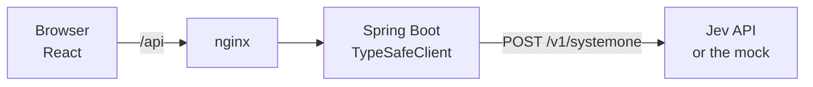

<p align="center">
  <picture>
    <source media="(prefers-color-scheme: dark)" srcset="docs/images/logo-dark.svg">
    
  </picture>
</p>

<p align="center">
  <b>A playground for TypeSafe Jev.</b><br>
  Ask typed questions about any text or JSON, see the answers as distributions and confidences,<br>
  and find the thresholds that hold — before you write a line of code.
</p>

<p align="center">
  <a href="LICENSE"></a>
  
  
  
  
</p>

<p align="center">
  <a href="#quickstart">Quickstart</a> ·
  <a href="#how-it-works">How it works</a> ·
  <a href="#features">Features</a> ·
  <a href="#development">Development</a>
</p>

## Why

[Jev](https://docs.typesafe.ai/introduction) is not a chat model. It writes no text; it answers
typed questions about a *state* — a ticket, a comment, a CV, any JSON — with numbers: how true
is this, which label fits, where on this rubric does it sit. That makes it fast and cheap enough
to route, triage, gate and judge in places where an LLM call would be too slow or too vague.

But numbers need calibrating. Is 0.7 a safe threshold for "is urgent"? Does adding option
descriptions raise the confidence? Does a score land on the same side of the line twice in a
row? jev playground lets you try exactly that in the browser, against the real API, through the
[Spring AI community integration](https://github.com/spring-ai-community/spring-ai-typesafe) —
and hands you the Java code for the call once it does what you want.

## Features

- **Question editor for all three primitives.** Noul with optional `whenTrue` / `whenFalse`
  criteria, choice with option descriptions, score with ordered levels. State as plain text or
  JSON.
- **Answers you can read.** A noul as a gauge, a choice as its probability distribution, a
  score as a position on the rubric with the probability of every level — plus model, latency,
  tokens and request id. Or the raw JSON.
- **Java code for the call.** Every request is shown as the `SystemOneRequest` builder code for
  `TypeSafeClient`, ready to copy.
- **Batch.** The same questions against many states, run concurrently with `systemOneAll`.
- **Consistency sampling.** Ask the same questions up to 50 times and see the spread; questions
  whose samples straddle your threshold are flagged (`JevConsistency`).
- **Confidence gate.** Decide per choice answer whether to execute, confirm or escalate, with a
  floor and stricter limits for risky actions (`JevConfidenceGate`).
- **Composite scores.** Score candidates once and rank them under several weighting profiles
  (`JevCompositeScore`).
- **Examples to start from.** Ticket triage, content moderation, banking intent, candidate
  scoring. Your questions, state and model are kept in the browser.

## Quickstart

You need Docker with Compose. Python 3 is only needed for the offline demo.

**Try it without an API key.** A small mock that ships with the repo speaks Jev's wire format
and returns plausible-looking — but random — answers:

```bash
git clone https://github.com/dan-devp/jev-playground.git
cd jev-playground
cp .env.example .env                    # set TYPESAFE_API_KEY=mock
                                        # and TYPESAFE_BASE_URL=http://host.docker.internal:9099
python tools/mock-jev-server.py         # keep it running, port 9099
docker compose up -d --build            # in a second terminal
```

Open <http://localhost:5179>, pick an example under **Load example …** and click **Run**.

**Use the real Jev.** Put your key into `.env` (`TYPESAFE_API_KEY=...`), clear
`TYPESAFE_BASE_URL` and restart with `docker compose up -d`.

> [!NOTE]
> Every call goes to the TypeSafe API and is billed there. A batch of ten states is ten calls;
> consistency sampling with 15 samples is 15 calls.

Stop the stack with `docker compose down`.

## How it works

Every call sends one state and a set of named questions; Jev answers them all in parallel.

| Primitive | Ask | Get back |
|---|---|---|
| **Noul** | a yes/no question | a truth value in [0, 1]. No separate confidence — 0.5 *is* undecided |
| **Choice** | pick one label | the label, a probability per option, a confidence |
| **Score** | place on an ordered rubric | a continuous value (1.4 sits between levels 1 and 2), a probability per level, a confidence |



The tabs map onto the SDK:

| Tab | What it does | SDK |
|---|---|---|
| System One | One state, many questions, one call | `TypeSafeClient.systemOne` |
| Batch | Many states, the same questions | `TypeSafeClient.systemOneAll` |
| Consistency | Repeated calls with a fresh `uid` in the state, mean / spread / straddles | `JevConsistency` |
| Confidence Gate | `EXECUTE` / `CONFIRM` / `ESCALATE` per choice answer | `JevConfidenceGate` |
| Composite Score | Weighted rankings, scores normalised to [0, 1] per dimension | `JevCompositeScore` |

The backend is a thin REST layer over the SDK: `GET /api/models`, `POST /api/system-one`,
`/api/batch`, `/api/consistency`, `/api/confidence-gate`, `/api/composite`. Errors come back as
RFC 9457 problem details; Jev's own errors keep their status and carry `errorType`,
`requestId` and the validation errors.

## Configuration

Everything goes through `.env`; [`.env.example`](.env.example) explains each variable.

| Variable | Purpose |
|---|---|
| `TYPESAFE_API_KEY` | Required. Any value works against the mock |
| `TYPESAFE_BASE_URL` | Where Jev lives; empty means `https://api.typesafe.ai` |
| `TYPESAFE_MODEL` | The model behind "Default" in the UI, e.g. `jev-latest`, `jev-preview` |
| `FRONTEND_PORT`, `BACKEND_PORT` | Host ports, default 5179 and 8080 |

The backend also takes every `spring.ai.typesafe.*` property of the starter — timeout and
retry policy among them.

## Development

| Part | Stack |
|---|---|
| Backend | Java 25, Spring Boot 4.2, `spring-ai-starter-typesafe` 0.4, Jackson 3 |
| Frontend | React 19, TypeScript 7, Vite 8, Tailwind CSS 4 |
| Tools | `tools/mock-jev-server.py` (Jev-compatible mock) |

```bash
python tools/mock-jev-server.py
cd backend && TYPESAFE_API_KEY=mock ./gradlew bootRun --args=--spring.ai.typesafe.base-url=http://localhost:9099
cd frontend && npm install && npm run dev        # http://localhost:5173, proxies /api to 8080
```

Drop the mock and the `--args` to work against the real API with your key.

```bash
cd backend && ./gradlew test                     # the real SDK against a mocked Jev endpoint, no key needed
cd frontend && npm run build && npm run lint
```

## Status

jev playground covers the System One API and the patterns that build on it without a chat
model. Not there yet — all of these need an LLM next to Jev:

- `JevJudge` and `JevSelfRefineAdvisor` — judging and improving generated answers
- `JevGuardrailAdvisor` — screening prompts and replies
- `JevDocumentFilter`, `JevDocumentReranker` and `JevToolIndex` — RAG and tool selection

Ideas and issues are welcome.

## License

[MIT](LICENSE)
